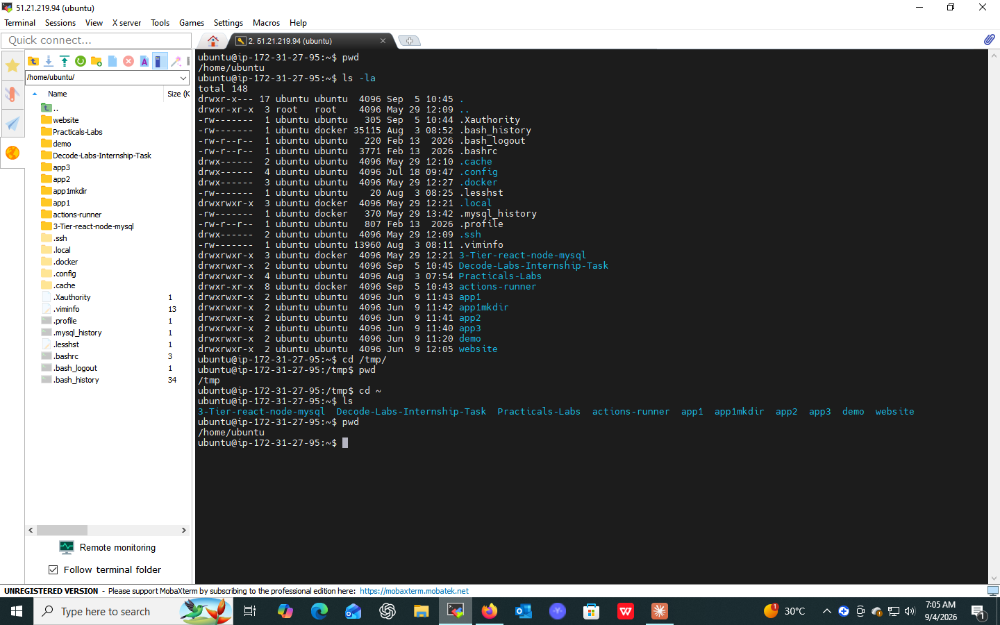
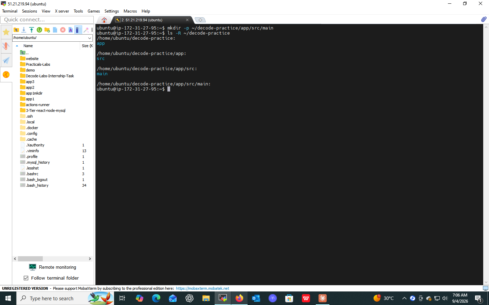
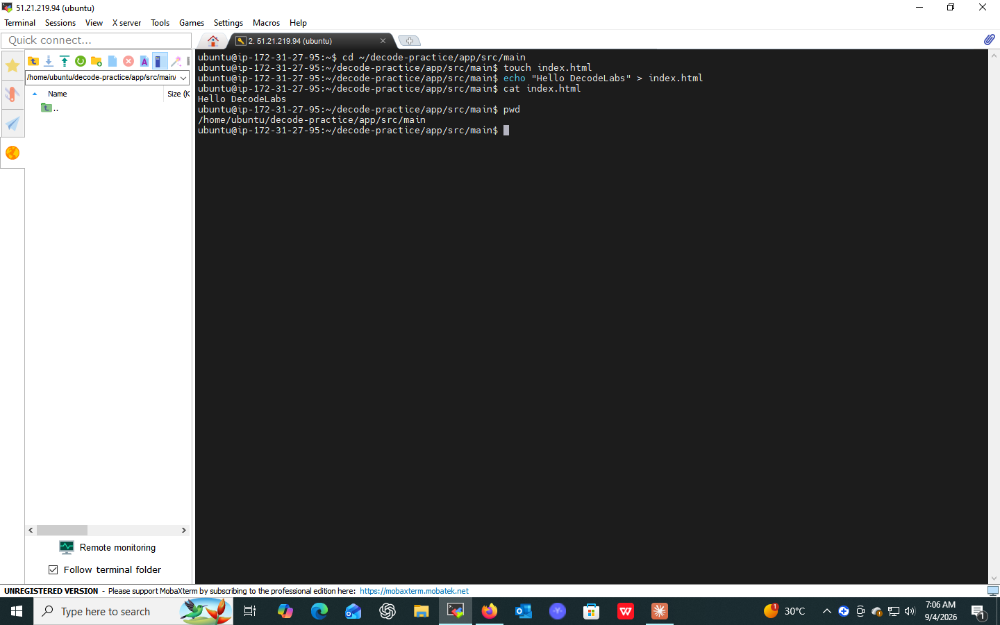
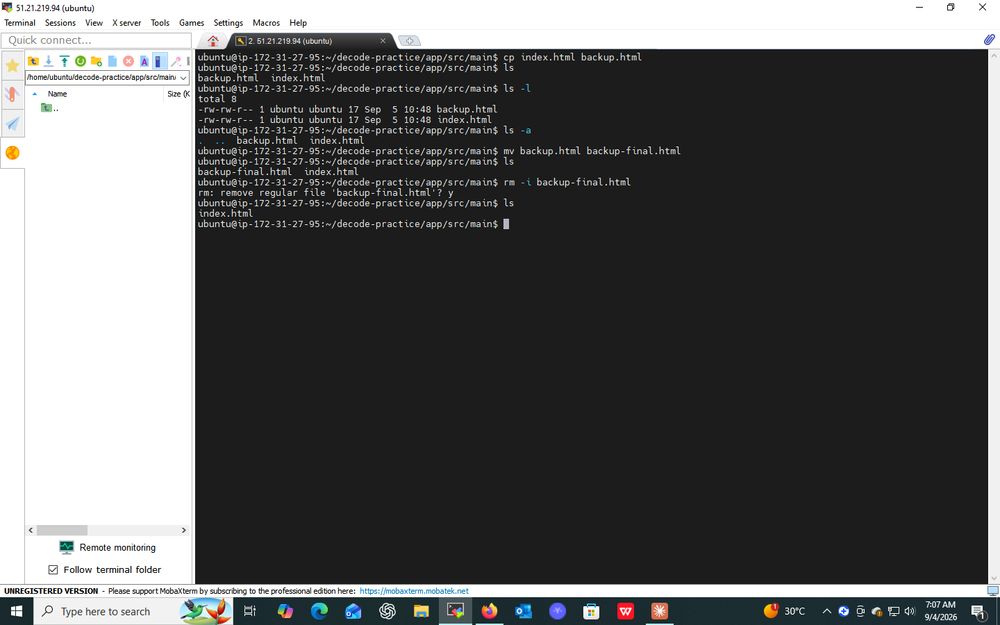
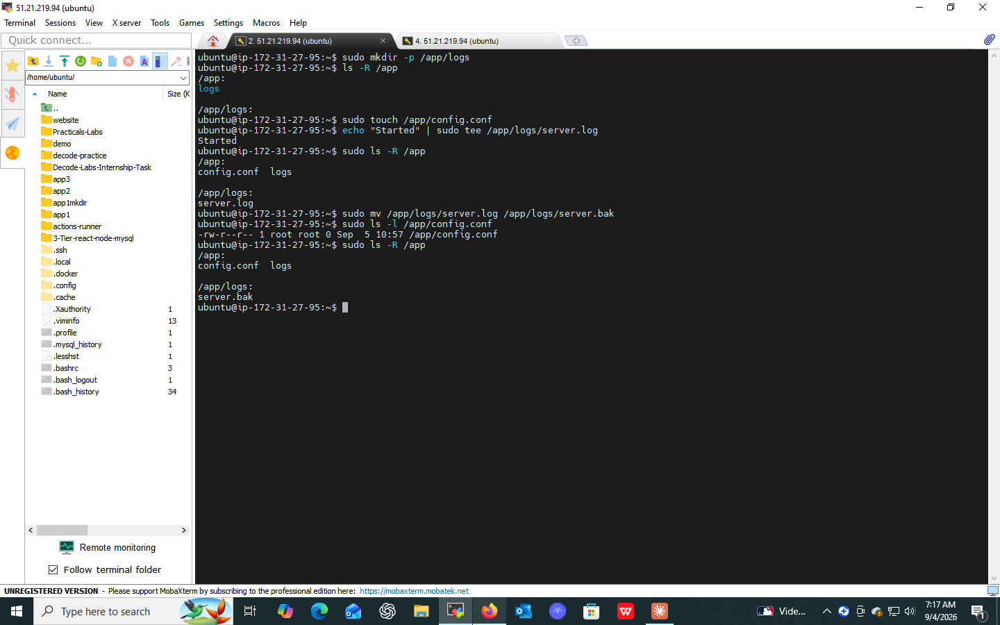
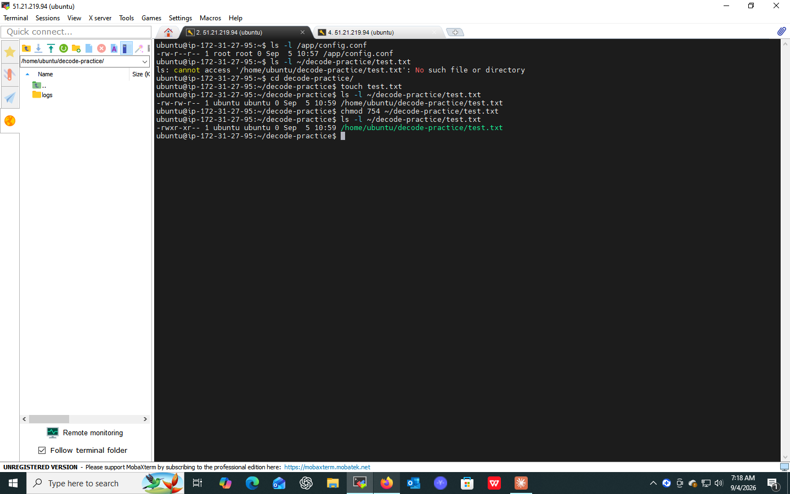

# DecodeLabs DevOps Internship — Task 01

## Linux & Command Line Basics 🐧

**Batch:** 2026
**Organization:** DecodeLabs
**Project:** 1 — Linux & Command Line Basics

---

## 📌 Project Overview

This project is the foundation phase of the DecodeLabs DevOps internship. The objective is to build practical Linux command-line skills required in DevOps environments.

The project focuses on:

- Navigating the Linux filesystem
- Creating and managing directories and files
- Reading and monitoring files from the terminal
- Understanding the Linux directory structure
- Practicing basic permissions and ownership concepts
- Building a small application-style directory structure from the command line

The DecodeLabs project guide identifies file and directory operations, basic commands such as `ls`, `cd`, `mkdir`, `rm`, and `cat`, and understanding the Linux directory structure as key requirements.

---

## 🎯 Objectives

By completing this project, I practiced:

- Linux terminal navigation
- Working with absolute and relative paths
- Creating nested directories
- Creating, reading, copying, moving, and removing files
- Listing files with useful options
- Viewing files using `cat`, `less`, `head`, and `tail`
- Monitoring a log file using `tail -f`
- Inspecting file permissions with `ls -l`
- Understanding basic Linux ownership and permission concepts
- Verifying the final filesystem structure

---

## 🛠️ Commands Practiced

### 1️⃣ Navigation

```bash
pwd
ls
ls -l
ls -a
ls -la
cd /path/to/directory
cd ..
cd ~
```

**📸 Screenshot 1 — Navigation**
Shows current location and basic listing (`pwd`, `ls -la`).



---

### 2️⃣ Directory Operations

```bash
mkdir app
mkdir -p app/src/main
ls -R app
```

**📸 Screenshot 2 — Directory Creation**
Shows creation of nested directories and verification with `ls -R`.



---

### 3️⃣ File Creation & Writing Content

```bash
touch index.html
touch /app/config.conf

echo "Started" > /app/logs/server.log
```

**📸 Screenshot 3 — File Operations**
Shows configuration file creation and log file content writing.



---

### 4️⃣ Copy, Move, and Delete

```bash
cp source destination
mv old new
mv /app/logs/server.log /app/logs/server.bak

# Delete carefully
rm -i filename

# Recursive delete for directories/files
rm -rf directory
```

> ⚠️ Always verify your location with `pwd` and check the target with `ls` before using destructive commands.

**📸 Screenshot 4 — Copy, Move & Delete**
Shows file copy, move, and safe deletion operations.



---

### 5️⃣ Reading and Monitoring Files

```bash
cat /app/config.conf
less /app/logs/server.log
head /app/logs/server.log
tail /app/logs/server.log
tail -f /app/logs/server.log
```

> Press `Ctrl+C` to stop `tail -f`.

**📸 Screenshot 5 — Log Monitoring**
Shows log creation and real-time monitoring using `tail -f`.


---

## 🚀 Project Mission

The main hands-on exercise is to create and verify the following application-style structure.

**Step 1 — Create the directory**
```bash
mkdir -p /app/logs
```

**Step 2 — Create the configuration file**
```bash
touch /app/config.conf
```

**Step 3 — Create the log file with initial content**
```bash
echo "Started" > /app/logs/server.log
```

**Step 4 — Verify the structure**
```bash
pwd
ls -R /app
```

**Step 5 — Create a backup**
```bash
mv /app/logs/server.log /app/logs/server.bak
```

**Step 6 — Audit permissions**
```bash
ls -l /app/config.conf
```

**📸 Screenshot 6 — Final Project Verification**
Shows the final directory structure, backup, and permission audit.



---

### 6️⃣ Permissions and Ownership — Practice

```bash
ls -l
chmod 754 filename
chown user:group filename
```

The permission pattern `-rwxr-xr--` corresponds to `754`:

- Owner: `rwx`
- Group: `r-x`
- Others: `r--`

**📸 Screenshot 7 — Permissions**
Shows permission inspection and `chmod` practice.



---

## 📂 Expected Structure

After completing the mission, the important structure should look similar to:

```
/app/
├── config.conf
└── logs/
    └── server.bak
```

---

## 🔎 Linux Filesystem Concepts

The project guide introduces the Linux filesystem hierarchy, including:

```
/
├── bin
├── boot
├── dev
├── etc
├── home
├── root
├── tmp
├── usr
└── var
```

Some important directories:

| Directory | Purpose |
|-----------|---------|
| `/`     | Root of the Linux filesystem |
| `/home` | User data/home directories |
| `/root` | Root user's home directory |
| `/etc`  | System-wide configuration |
| `/var`  | Variable data and logs |
| `/tmp`  | Temporary files |
| `/bin`  | Essential command binaries |
| `/sbin` | System/administrative binaries |
| `/usr`  | User-space programs and data |

---

## 🔐 Safety Practices

Linux commands can directly modify the system. Before destructive operations:

```bash
pwd
ls
```

For safer deletion:

```bash
rm -i filename
```

Avoid using `rm -rf` on important system paths unless you completely understand the target.

---

## 🧪 Practice Checklist

- [x] `pwd`
- [x] `ls`
- [x] `ls -l`
- [x] `ls -a`
- [x] `cd`
- [x] `cd ..`
- [x] `cd ~`
- [x] `mkdir`
- [x] `mkdir -p`
- [x] `touch`
- [x] `cat`
- [x] `less`
- [x] `head`
- [x] `tail`
- [x] `tail -f`
- [x] `cp`
- [x] `mv`
- [x] `rm -i`
- [x] `ls -R`
- [x] Basic `chmod` practice
- [x] Basic `chown` practice

---

## 💡 Key Learning

The most important lesson from this project is to become comfortable operating Linux through the command line rather than relying on a graphical interface.

A good DevOps workflow requires being able to:

**Navigate → Create → Inspect → Modify → Verify → Monitor**

The project also emphasizes precision, visibility, safety, and a command-line mindset.

---

## 🏁 Conclusion

DecodeLabs Project 1 provided hands-on practice with Linux filesystem navigation and command-line operations. I created and managed directories and files, inspected file contents and permissions, practiced safe file operations, and verified the final application-style directory structure.

This project establishes the Linux foundation needed for later DevOps work such as automation, CI/CD, containers, cloud infrastructure, and system administration.
