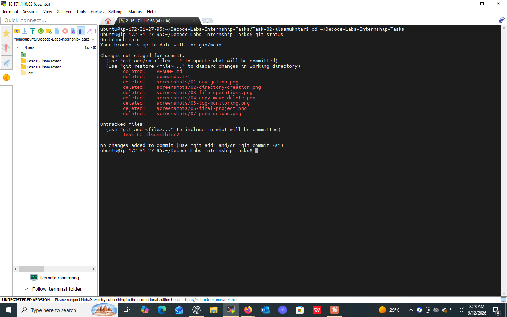
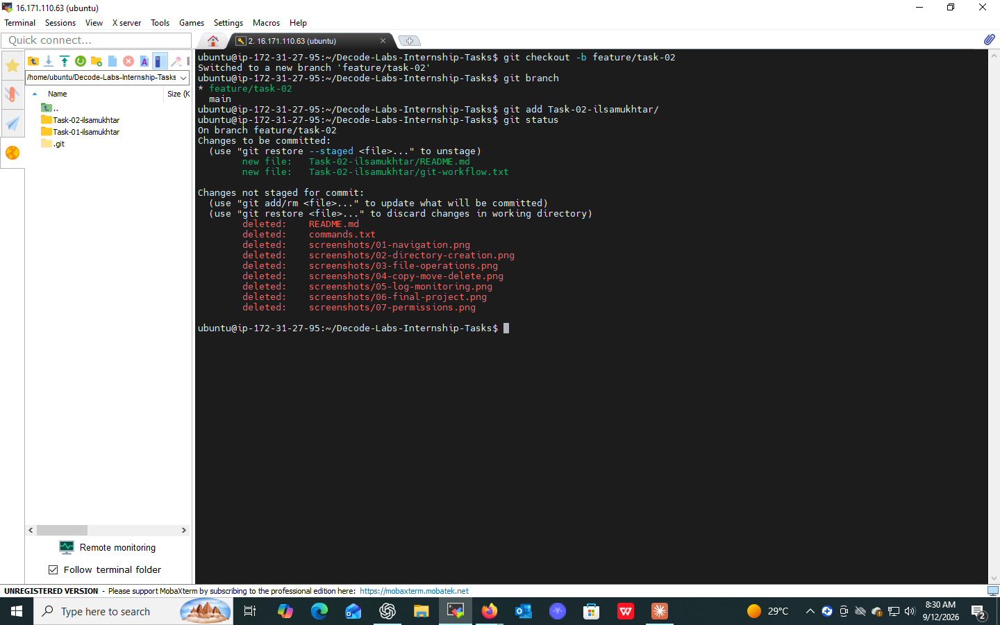
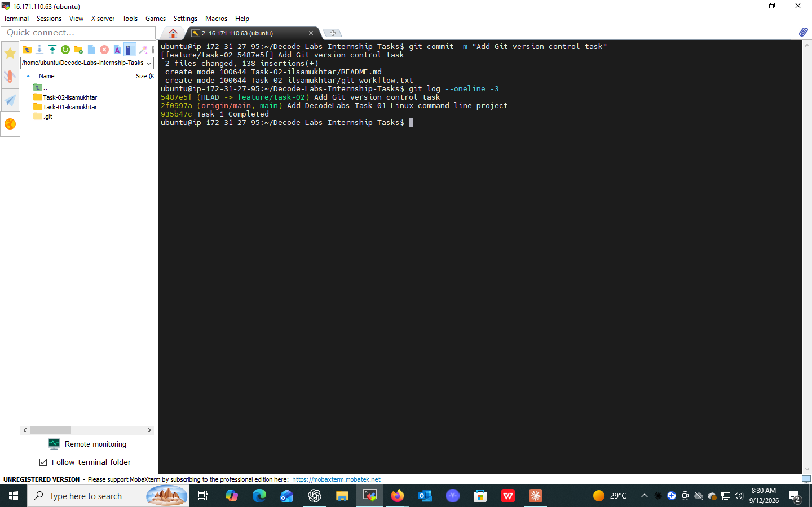
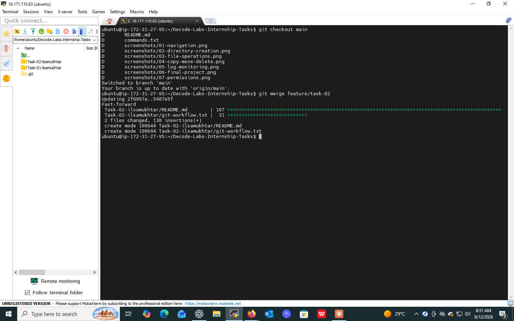
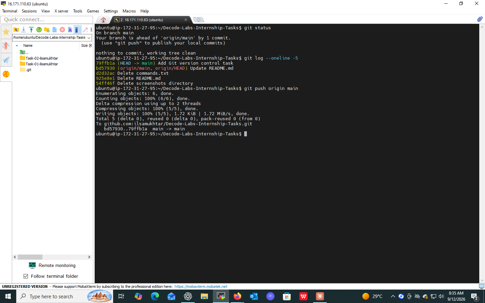

# Task 02 — Version Control with Git

## 📌 Overview

This project demonstrates the fundamentals of **version control using Git and GitHub**.

The objective of this task was to understand how Git can be used to track changes, manage branches, create commits, and collaborate through a remote GitHub repository.

---

## 🎯 Objectives

- Understand the basic Git workflow
- Initialize and manage a Git repository
- Track project changes
- Create and manage branches
- Stage and commit changes
- Merge changes into the main branch
- Push project changes to GitHub

---

## 🔄 Git Workflow

The following workflow was practiced during this task:

```text
Working Directory
       ↓
    git status
       ↓
    git add
       ↓
   git commit
       ↓
    git push
       ↓
     GitHub
```

A feature branch was also used to practice branch-based development:

```text
main
  │
  └── feature/task-02
          │
          └── Changes
                │
                ↓
             Commit
                │
                ↓
              Merge
                │
                ↓
              main
```

---

## 🛠️ Commands Practiced

| Command | Purpose |
|---|---|
| `git status` | Check the current repository status |
| `git checkout -b` | Create and switch to a new branch |
| `git add .` | Stage project changes |
| `git commit` | Save changes to Git history |
| `git checkout` | Switch between branches |
| `git merge` | Merge branch changes |
| `git log --oneline` | View commit history |
| `git push` | Upload commits to GitHub |

---

## 📂 Project Files

```text
Task-02-ilsamukhtar/
├── README.md
└── git-workflow.txt
```

---

## 🖼️ Screenshots

> Screenshots are stored in a `screenshots/` folder inside `Task-02-ilsamukhtar/`. Add the images there and keep the file names below so the links work.

**1. Change Detection**
Git detecting the new `Task-02-ilsamukhtar` folder as untracked.



**2. Branch Creation**
Creating and switching to the `feature/task-02` branch.



**3. Staging & Commit**
Staging the changes and committing them with a message.



**4. Merge into Main**
Merging `feature/task-02` back into `main` (fast-forward merge).



**5. Push to GitHub**
Successfully pushing the final changes to the remote repository.



---

## ✅ Outcome

Successfully practiced the fundamental Git workflow, including change tracking, branching, committing, merging, and pushing changes to GitHub.

This task strengthened my understanding of version control and collaborative software development practices.

---

## 🧠 Skills Demonstrated

`Git` | `GitHub` | `Version Control` | `Branching` | `Commits` | `Merging` | `Repository Management`
